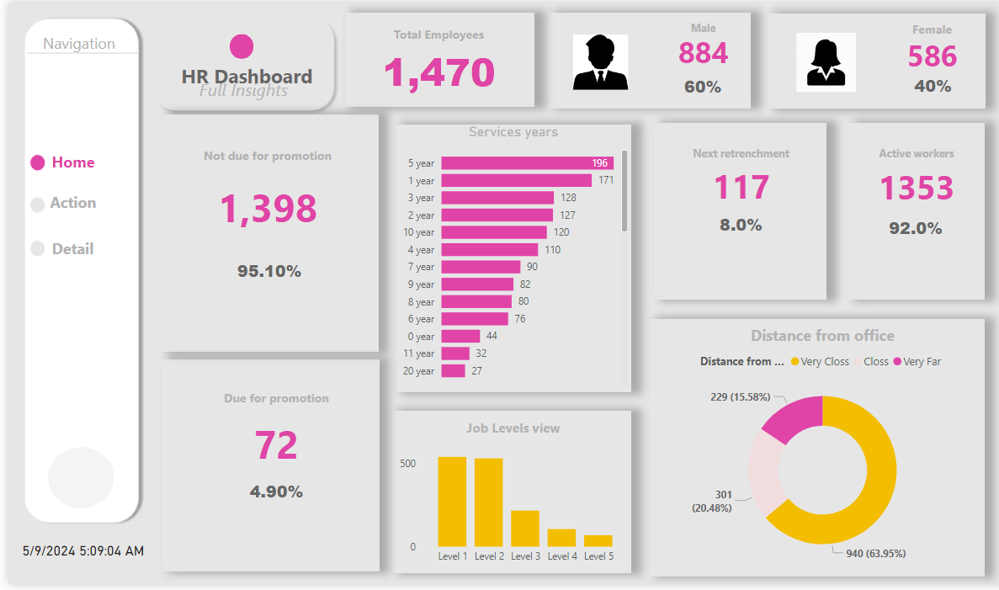
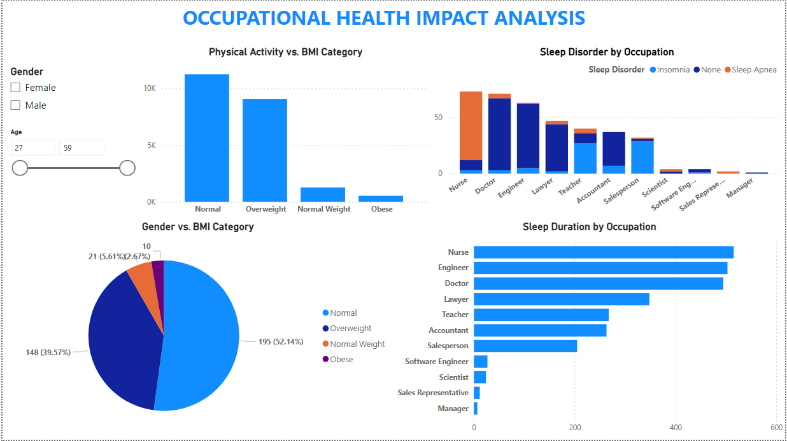

# Divine Ezeigwe Data Analytics Portfolio

# Project 1
**Title**: [HR Analysis Dashboard](https://github.com/Ifeanyi-Ezeigwe/Data_Analytics)

**Project Description**: This dashboard provides valuable insights for human resource management, talent development, and organizational decision-making. 

It indicates an employee turnover of 1,470. This metric represents the number of employees who have left the organization during a specific period.
High turnover may signal potential issues related to job satisfaction, work environment, or management practices.

The gender distribution shows that 60% of the workforce is male, while 40% is female.
the company will use this data to assess gender diversity and identify any gender-related disparities.

The dashboard also reports that the company has a total 932 active workers, representing 95.10% of the total workforce.
Understanding the proportion of active employees helps in workforce planning and resource allocation.

There are 72 employees due for promotion. This highlights potential career growth opportunities within the organization.
Effective talent management involves identifying and nurturing employees for advancement.

The line graph depicting service years provides insights into employee tenure.
the company can analyze trends and identify retention challenges based on service duration.

The bar chart shows the distribution of employees across different job levels.
It’s essential to maintain a balanced workforce across various roles and responsibilities.

The pie chart categorizes employees based on their distance from the office.
Understanding commuting patterns can inform decisions related to office locations and remote work policies.

The percentages next to the graphs indicate net enrichment (117%) and an 8.8% increase in the active workforce.
These metrics reflect positive trends and organizational health.

In summary, the company can use this data to address challenges, optimize workforce strategies, and foster a positive work environment. 

**Dashboard Overview**: The dashboard prominently displays the total number of employees, 1,470, emphasizing that these are individuals, not just numbers.
It provides a breakdown of employees by gender, with 884 males and 586 females.

It shows that 50% of the workforce is active, with an upward trend, suggesting a growing or highly engaged workforce.

Service years are represented in bar graphs, categorizing employees based on their length of service, which is crucial for understanding workforce stability and experience.

The dashboard also highlights employees due for promotion, indicating a high percentage (95.10%) of the workforce might be eligible for advancement.

The horizontal bar graph under “Job Levels view” shows the distribution of employees across various job levels, which can help in planning career progression paths and training needs.

The pie chart illustrates the distance employees live from the office, with a significant portion living within 20 km, which could impact commuting policies or remote work options.

In summmary, this HR dashboard provides valuable insights into the workforce composition, activity levels, and potential areas for career development, which are essential for strategic HR planning and decision-making.

 

# Project 2
**Title**: [Adidas Interactive Sales Dasboard](https://ifeanyi-ezeigwe.github.io/Data_Analytics/)

**Project Description**: This dashboard provides a comprehensive view of Adidas’ sales performance, 
offering actionable insights that can help optimize sales strategies, product distribution, and regional focus. 
It’s a valuable tool for making data-driven decisions in the retail space. 

The “Total Sales by Retailers” bar graph indicates that sales figures vary significantly across retailers. 
This suggests that certain retailers may have more effective sales strategies or stronger market presence.

The “Total Sales by Products and Retailers” bar graph shows how different products perform across various retailers. 
This could inform decisions on which products to stock more heavily or promote in specific retail outlets.

The pie chart “Total Units by Sales Method” reveals the proportion of units sold through different methods, highlighting the most effective sales channels.
The “Top 5 Cities with Highest Units Sold” bar graph ranks cities based on unit sales, pinpointing urban markets with high demand. 

Meanwhile, the “Total Operating Profit by Regions” graph shows profit margins, which can guide resource allocation to the most profitable regions.
The left panel presents a couple of slicers and timeline with filters for Attendees, Retailers, Region, and Product allows for a customized analysis, enabling stakeholders to drill down into specific data points for a more granular understanding of sales trends.

**Dashboard Overview**: The “Adidas Interactive Sales Dashboard” provides a multi-dimensional view of sales data. Here’s an overview:
It allows for a comparison of sales across different retailers like Finish Line, Foot Locker, and Major Gear, which can help identify which outlets are performing well and which may need more support or marketing efforts.

It breaks down sales by product category, such as Apparel and Footwear, offering insights into consumer preferences and potential areas for product development or promotion.

Sales data is further dissected by region, highlighting areas with strong sales, which could be indicative of market trends or the effectiveness of regional marketing campaigns.

The sales method is also analyzed, providing information on how consumers prefer to purchase products, whether in-store or online, which can inform sales strategy and customer engagement approaches.

The dashboard also ranks cities by units sold, which can be useful for targeting marketing efforts or expanding retail presence in high-performing locations.

Operating profit by region is analysed, offering a clear picture of financial performance and indicating where the company is most profitable.

The dashboard is interactive dynamic in nature, with filters for attendees, retailers, regions, and products, which allows users to tailor the data view to their specific needs, making it a powerful tool for strategic decision-making in sales and marketing.

# Project 3
**Title**: [Vrinda interactive sales dashboard](https://ifeanyi-ezeigwe.github.io/Data_Analytics/)

**Project Description**: This dashboard gives an insight into the sales performance for Vrinda Sales.

At the top left, there are filter options for Area, Period, and Category, allowing users to tailor the data they see. 
The ‘Channel’ and ‘Agent’ lists enable further refinement of the data.

The “Order by Channel” bar graph shows the number of orders per channel, providing insights into which channels are most effective for sales.

A pie chart titled “Sales based on Gender” illustrates the distribution of sales between males and females, which can help in understanding consumer demographics.

The “Orders & Sales per month” graph combines bars and lines to depict monthly orders and sales, offering a view of sales trends over time.

The “Order Status Performance” section uses horizontal bars to show performance metrics for different order statuses, indicating areas of efficiency or delay in the sales process.

On the right side, the “Top 5 State with Highest Sales” section ranks states by sales volume, highlighting key markets.

**Dashboard Overview**: The stakeholders can customize views using filters for Area, Period, Category, Channel, and Agent.

The dashboard compares order volumes across sales channels.

The pie chart shows the sales distribution between male and female customers.

The bar and line graphs illustrate orders and sales over time, indicating growth or seasonal patterns.

Order status performance metrics help identify process strengths and weaknesses.

Overall, the dashboard is a dynamic tool for analyzing sales data, understanding customer demographics, and improving sales strategies.

# Project 1
**Title**: [Occupational Health Impact Analysis](https://ifeanyi-ezeigwe.github.io/Data_Analytics/)

**Project Description**: This dashboard gives insight into the Occupational Health Impact Analysis, particularly examining BMI (Body Mass Index) categories and sleep disorders across various occupations.

On the left side, there’s a pie chart that categorizes BMI into four groups: underweight, normal weight, overweight, and obese. 
This visual representation helps to quickly grasp the overall health status related to body weight within the workforce.

Below the BMI pie chart, a gender distribution bar indicates the proportion of male and female employees, 
providing insights into the gender demographics of the workforce.

The central bar graph contrasts physical activity levels (sedentary, low, moderate, active) against BMI categories, offering an analysis of lifestyle choices in relation to body weight.

On the right, the top horizontal bar graph displays the prevalence of sleep disorders, such as insomnia and sleep apnea, across different occupations, highlighting occupational risks associated with poor sleep quality.

The bottom graph on the right side shows sleep duration by occupation, which can be crucial for understanding how work demands impact rest and recovery.

This dashboard is a valuable tool for health professionals and researchers to analyze how occupational factors influence BMI and sleep patterns, which are critical components of overall health and well-being. It provides a clear and interactive overview of health-related data for strategic decision-making in occupational health management.

**Dashboard Overview**: "**Occupational Health Impact Analysis**” dashboard has a significant correlation between occupation and health-related factors such as BMI and sleep quality. 

The data shows that certain occupations may be associated with higher rates of obesity or sleep disorders, 
which could be due to job-related stress, physical demands, or lifestyle constraints. 

This insight is crucial for developing targeted wellness programs and interventions to improve the overall health and well-being of employees in specific occupational sectors.

# Project 5
**Title**: [Vrinda interactive sales dashboard](https://ifeanyi-ezeigwe.github.io/Data_Analytics/)

**Project Description**:

**Dashboard Overview**: 

